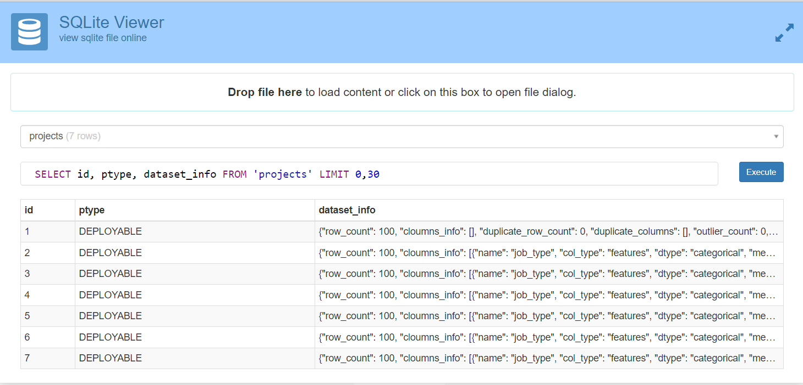

# SQLAlchemy Custom Column Type for Pydantic Models



This repo demonstrates a custom SQLAlchemy column type that allows you to save and load Pydantic models directly in your SQLAlchemy database. It simplifies the process of storing and retrieving complex data structures in your database without manual conversion to JSON or dictionaries.

## Introduction

In many projects, you might have complex data structures represented using Pydantic models. This custom SQLAlchemy column type, `PydanticModelType`, enables you to store Pydantic model instances in your SQLAlchemy database. When you save data, it automatically serializes the Pydantic model to JSON, and when you retrieve data, it deserializes the JSON back to the Pydantic model.

## Getting Started

To use this custom column type in your project, you'll need to:

1. Include the `PydanticColumn` class while creating sqlalchemy ORMs model, as defined in [custom_pydantic_column.py](custom_pydantic_column.py).
2. Define your Pydantic models, such as the `pydantic_model.py` example provided in the code.

## Usage

1. Import the `PydanticColumn` class from the `custom_pydantic_column.py` file.
2. Define your SQLAlchemy model and use the `PydanticColumn` column type for any Pydantic models you want to store in the database.
3. Insert Pydantic instances directly into the database, and they will be automatically serialized to JSON.
4. When retrieving data from the database, the JSON will be deserialized back to Pydantic instances.

## Examples

Here's an example of how to use this custom SQLAlchemy column type:

```python
# Define a Pydantic model
# kindly check `src/pydantic_model.py`
class PydanticModel(BaseModel):  
    attr1: str
    attr2: int
    attr3: List[Another_Pydantic_Model]

# Create an SQLAlchemy model that uses PydanticModelType
# Kindly check `src/orms.py`
class ExampleModel(Base):
    # ...
    fiel21: Mapped[int] = mapped_column(primary_key=True, autoincrement=True)
    filed2: Mapped[Python_Enums] = mapped_column(Enum(Python_Enums), nullable=False)
    filed3: Mapped[Optional[PydanticModel]] = mapped_column(
        PydanticColumn(PydanticModel), nullable=True
    )

kindly check `dbio.py` for insert and select script  